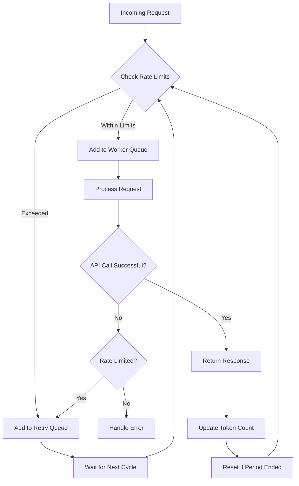

# OpenAICompletionServer API Mapper Project

## Overview

This project implements a high-performance, rate-limit-aware mapper for the OpenAI API. It's designed to handle a large volume of requests efficiently while respecting API rate limits and managing concurrent operations.

## Features

- Efficient handling of concurrent API requests
- Rate limiting to prevent API quota exhaustion
- Asynchronous processing for improved performance
- Configurable settings for API usage and server parameters

## How It Works

The Mapper uses a sophisticated rate limiting mechanism to manage API requests efficiently. Here's a flowchart illustrating the process:



### Explanation:

1. **Incoming Request**: Each API request enters the system.
2. **Check Rate Limits**: The system checks if the request would exceed rate limits.
3. **Worker Queue**: If within limits, the request is added to the worker queue for processing.
4. **Retry Queue**: If limits are exceeded, the request is added to a retry queue.
5. **Process Request**: Workers process requests from the queue.
6. **API Call**: The system makes the API call to OpenAI.
7. **Handle Response**: Successful responses are returned, and token counts are updated.
8. **Error Handling**: Failed requests are checked for rate limiting and handled accordingly.
9. **Cycle Management**: The system continuously cycles through queues and resets counters as needed.

This approach ensures efficient use of the API while respecting rate limits and managing high volumes of requests.

## Installation

1. Clone the repository:
   ```bash
   git clone [your-repo-url]
   cd [your-repo-name]
   ```

2. Install the required dependencies:
   ```bash
   pip install -r requirements.txt
   ```

3. Set up your environment variables:
   Create a `.env` file in the root directory and add your OpenAI API key:
   ```
   OPENAI_API_KEY=your_api_key_here
   ```

## Usage

The main entry point for the application is `src/__main__.py`. Use the following command to launch the engine:

```bash
python -m src launch-engine [OPTIONS]
```

### Options:
- `--max_concurrent_reqs INTEGER`: Maximum number of concurrent requests [required]
- `--rpm INTEGER`: Maximum requests per minute [required]
- `--tpm INTEGER`: Maximum tokens per minute [required]
- `--period_length INTEGER`: Rate limit period length in seconds [default: 60]
- `--max_nb_sockets INTEGER`: Maximum number of sockets [default: 1024]

Example:
```bash
python -m src launch-engine --max_concurrent_reqs 100 --rpm 1000 --tpm 100000
```

## Project Structure

```
src/
├── api_server/
│   ├── api_schemas.py
│   ├── completion_schema.py
│   ├── mapper.py
│   └── server.py
├── settings/
│   ├── openai_settings.py
│   └── server_settings.py
├── __init__.py
├── __main__.py
├── client.py
├── log.py
└── test.py
```

- `api_server/`: Contains the core logic for API handling and mapping
- `settings/`: Includes configuration files for OpenAI API and server settings
- `__main__.py`: The main entry point for running the application
- `client.py`: Client-side utilities (if applicable)
- `log.py`: Logging configuration
- `test.py`: Test suite for the project

## Configuration

The project uses two main configuration classes:
1. `OpenaiSettings`: Configures OpenAI API-related parameters
2. `ServerSettings`: Configures server-related parameters

These settings are loaded from environment variables or default values.

## Development

To contribute to this project:

1. Fork the repository
2. Create a new branch for your feature
3. Implement your changes
4. Write or update tests as necessary
5. Submit a pull request

## Testing

Run the test suite using:

```bash
python -m unittest discover tests
```

## License

[Specify your license here]

## Contact

[Your contact information or contribution guidelines]